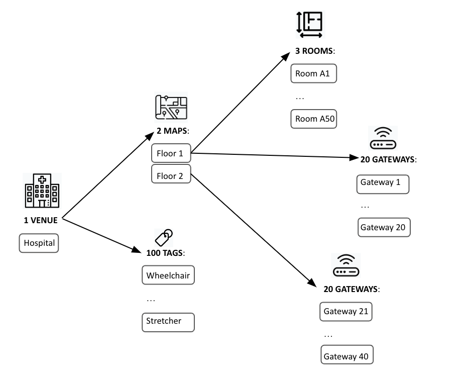
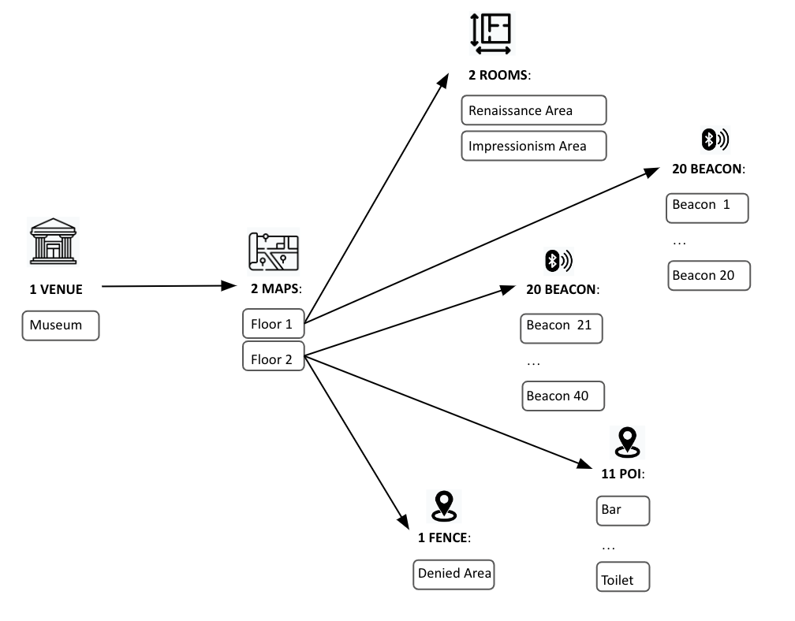
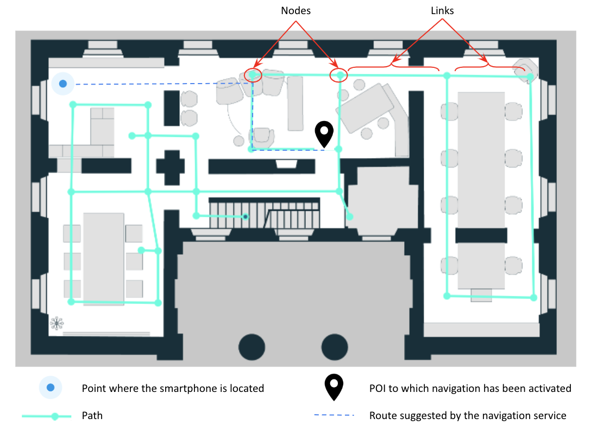

# Fundamental Definitions
## Prerequisites
In this document, all the definitions of the fundamental concepts within the Nextome Hub are provided. 

Before reading this document, it is recommended that you read the document 'The two technologies and the tools'.

The content of this document is essential for understanding the meaning of the documents:

-   SDK Documentation 
-   Web APIs Documentation
-   Map View Documentation
-   Nextome Hub Web Guide
-   Installation Guide for Smartphone - based localization
-   Installation Guide for Tag Tracking 

## Introduction and Context
For the operation of the two Nextome technologies, the following steps are necessary:

1. Creation within the Nextome Hub of the **'Venue'** resource, which represents the area where the technology is installed.
2. Creation within the Nextome Hub of **'Map'** resources, one for each floor, and association with the corresponding Venue.
3. Physical installation of hardware within the structure.
4. Registration of the installed hardware within the Nextome Hub.
Once the above steps are completed, the technology is capable of calculating the 'Positions' of the items being localized, which can be a **'Tag'** or a **'Device'** (smartphone).
5. To enable additional services beyond position calculation, such as **navigation** or **geofencing** , it is necessary to create additional resources on the relevant 'Maps' within the Nextome Hub.

The concepts introduced in points 1 and 2 will be explored in-depth in the **'Concepts related to the installation site'** section.

The concepts introduced in points 3 and 4 will be presented and described in the **'Concepts related to hardware'** section.

The concepts introduced in point 5 will be presented and described in the **'Concepts related to the navigation service'**, **'Concepts related to the geofencing service'** and **'Concepts related to virtual rooms creation'** sections.

The concepts related to the calculated positions from the localization engine will be explored in the **'Concepts related to calculated positions'** section.

For each concept:

- It will be specified which technology it involves (tag tracking, smartphone tracking, or both).
- The context in which it is used will be briefly explained.
- A definition will be provided based on its primary characteristics.

### Examples
Below we present two examples of configurations, in the case of the two technologies.

*Example of tag tracking*

Tracing 100 tags in a hospital with 2 floors, the technology is based on the detections of 20 gateways installed on each floor.
50 virtual rooms are created on the first floor. 
The following image shows the basic elements of the configuration.

*Example of smartphone tracking*

Track smartphones in a Museum with 2 floors, 20 Beacons installed on each floor.
On the first floor, 2 virtual rooms are created. On the second floor 1 Fence area and 11 Points of interest are created.
The following image shows the basic elements of the configuration.

## Concepts related to the installation site
### Venue
:material-cellphone-cog: Smartphone Tracking  :material-tag: Tag Tracking 

*Definition*

The concept of '**Venue**' represents the location where the Nextome technology is installed. 
For each Venue, at least one 'Map' must be associated, referring to a single floor within the structure. If there are multiple floors, there will be multiple Maps associated with the Venue.
The concept of Venue is linked to the timezone to be associated with the positions of devices calculated by the installation within that specific Venue.
Furthermore, since the functionality of the technology is configurable based on the Venue, the settings that the technology uses must be associated with the Venue.
The Venue concept can also be associated with an address and latitude and longitude coordinates for georeferencing purposes.

### Map
:material-cellphone-cog: Smartphone Tracking  :material-tag: Tag Tracking 

*Definition*

The concept of '**Map**' refers to a single floor of a specific Venue. 
For each Map, an image of the floor plan must be associated in the form of a PNG file, along with its corresponding scale. The PNG file is created by the Nextome team following specific standards, starting from any floor plan representation provided by the user. 
The PNG file plays a crucial role as all resources are characterized by a map position in the form of pixel coordinates (x, y).

*Example:*
If the technology is installed in a three-floors hospital, a Venue will be created, and three Maps will be associated with it, each with its corresponding PNG file representing the floor plan of the respective floor.

## Concepts related to hardware
In this section, concepts related to the hardware components of the two technologies are defined. To enable the functionality of the technologies, every hardware component installed in the environment must be registered within the Nextome Hub. After registering the hardware components that make up the installed architecture, the system is capable of calculating the position of Tags or Devices (smartphones) accordingly, depending on whether it is tag tracking or smartphone tracking.

### Beacon
:material-cellphone-cog: Smartphone Tracking

*Definition*

The concept of '**Beacon**' refers to a physical device installed in the environment that serves as a reference anchor within the context of the 'Smartphone tracking' technology.
Each Beacon physically installed in this context must have a corresponding Beacon object within the Nextome system. The Beacon object is uniquely identified by the triplet (UUID, Major, Minor), and it must be associated with the location where the Beacon is installed.
Once the corresponding Map object for the floor where the Beacon is installed is determined, its position is defined by two elements:

1. The Map object.
2. The pair of coordinates (x, y) on the PNG file of the 'map', representing the specific point where the Beacon is physically installed.

The Beacon object can also contain information related to the Beacon, such as battery level.

### Tag
:material-tag: Tag Tracking  

*Definition*

The concept of '**Tag**' refers to a sensor to be located within the context of tag tracking technology. The Tag can be associated with an object or a person.
Each sensor physically associated with the entity to be located must have a corresponding Tag object within the Nextome system. The Tag object is uniquely identified by the triplet (UUID, Minor, Major), and it must necessarily be associated with the Venue where the technology aiming to locate it is installed.
It's not possible to associate a specific Map with the Tag since it refers to a locatable entity that could move from one Map to another.
The Tag object can contain:

- Information related to the sensor, such as battery level.
- Information related to the object/person to be located, such as a label.

### Gateway
:material-tag: Tag Tracking 

*Definition*

The concept of '**Gateway**' refers to the Bluetooth antenna that serves as a reference anchor, physically installed in the environment within the context of 'Tag tracking' technology. Each antenna installed in this context must have a corresponding Gateway object within the Nextome system.
The Gateway object is uniquely identified by a specific serial number of the antenna, and it must necessarily be associated with the location where the antenna is installed. Once the corresponding Map object for the floor where the Gateway is installed is determined, its position is defined by two elements:

1. The Map object.
2. The pair of coordinates (x, y) on the PNG file of the 'Map', representing the specific point where the Gateway is physically installed.

The Gateway object can also contain information related to the Gateway, such as a label.

## Concepts related to the navigation service
One of the additional services is navigation to points of interest (POIs) registered within the system. This service is relevant only in the context of 'smartphone tracking' technology and can be accessed through an app that integrates the Nextome SDK. The calculation of the recommended navigation path by the navigation service is based on paths (Paths) registered within the system.
Let's define the mentioned objects 'POI' and 'Path' below.

### POI (Point Of Interest)
:material-cellphone-cog: Smartphone Tracking

*Definition*

The concept of '**POI**' represents a location to which the navigation service is enabled. Consequently, it must necessarily be associated with a map position.
Its position is defined by two elements:

1. The Map.
2. The pair of coordinates (x, y) on the PNG file of the 'Map', representing the specific point where the point of interest is physically located.

The POI object is also characterized by information related to the point of interest, such as a name, a description, and optionally an image.

### Path
:material-cellphone-cog: Smartphone Tracking

*Definition*

The concept of '**Path**' represents a graph defined on the PNG file of a specific Map, which serves as the basis for calculating the suggested route by the navigation service. A Path can also span multiple floors, enabling multi-floor navigation.
The Path is composed of 'Nodes' and 'Links' (an example is shown in the figure). Given the Map where the Path is defined, Nodes and Links are specified using pixel coordinates (x, y) on the PNG file of the Map.
When the navigation service is activated towards a specific POI, the system suggests the optimal route constrained by the graph associated with the map. By defining Paths, it's possible to constrain the recommended routes provided by the navigation service.
In the following image, an example of a recommended route by navigation based on the Path in the system is represented.

## Concepts related to the geofencing service
One of the additional services is the ability to define events to be invoked when conditions related to the relationship between the position of the Tag/smartphone to be located and predefined areas on the map's floor plan, called 'Fence', occur.
This service is currently available within the context of smartphone localization technology, which assumes that a mobile application with the Nextome SDK is active. The available conditions at the moment are 'entry' and 'exit' into and from a Fence. In other words, it's possible to detect when a smartphone enters or exits a 'Fence'.
To utilize this service, it's necessary to create Fences on the PNG file of the Map.

### Fence
:material-cellphone-cog: Smartphone Tracking

*Definition*

The concept of '**Fence**' represents a circular area defined by:

- The reference to the Map object in which it is created.
- The pixel coordinates (x, y) of the center on the PNG file of the map on which it is created.
- The radius length expressed in pixels. 

The Fence object also contains a description.

## Concepts related to virtual room creation
The calculated position of a Tag or Smartphone is defined by the Map in which it resides and the pixel coordinates (x, y) on the map's floor plan file. This means that a position is not interpretable unless it is placed on the PNG file of the map. To overcome this limitation, the need arose to label certain subsections of the map, which are referred to as 'Rooms'.

### Room
:material-cellphone-cog: Smartphone Tracking  :material-tag: Tag Tracking 

*Definition*

The concept of '**Room**' is related to a section of the map, defined by a polygon or a circle, which in turn are defined by pixel coordinates (x, y) on the map's PNG file. The Room object is often characterized by a meaningful label for the end user. Every time the calculated position of a Tag or Smartphone falls within a Room, that position will be associated with the Room and can be interpreted by the user without requiring visualization on the PNG file.

## Concepts related to calculated positions
The primary goal of the 'Tag tracking' and 'Smartphone tracking' technologies is to calculate the position of a Tag and a Smartphone, respectively. In this section, the definition of the 'Position' concept and its aggregated version 'Visit' is presented.

### Position
:material-cellphone-cog: Smartphone Tracking  :material-tag: Tag Tracking  

*Definition*

The concept of '**Position**' represents the location of the entities to be located, calculated by the localization technology. The Position is therefore linked to the Tag or Smartphone that is being localized by the localization technology. The Position must also be associated with the instant it is calculated and consists of the Map element and pixel coordinates (x, y) on the map's PNG file.
If Rooms are defined for that specific map, the position can also include an association with the Room that contains the position.

### Visit
:material-cellphone-cog: Smartphone Tracking  :material-tag: Tag Tracking  

*Definition*

The concept of '**Visit**' aggregates all the positions of a specific Tag/Smartphone from the moment it enters a particular Room until the moment it exits.
A Visit is therefore associated with a specific Tag/Smartphone and is characterized by a Room, along with the two instants of entry and exit of that particular Tag/Smartphone from that specific Room.

*Example*

If the tag, with id 10, enters in the room, with id 3, at 10:00 and leaves at 11:00, a visit will be created with:

- tag :material-arrow-right: 10
- room :material-arrow-right: 3
- starting time :material-arrow-right: 10:00:00
- final time :material-arrow-right: 11:00:00

## Interactions between tools and concepts

|             | Nextome Hub Web            | Api                        | Venue Configurator         | NextomeSDK                 |
| ----------- | -------------------------- | -------------------------- | -------------------------- | -------------------------- |
| Venue       | Create, Edit, View         | Create, Edit, View, Delete |               View         |               View         |
| Map         | Create, Edit, View, Delete | Create, Edit, View, Delete |         Edit, View         |               View         |
| Beacon      | Create, Edit, View, Delete | Create, Edit, View, Delete | Create, Edit, View, Delete |               View         |
| Tag         | Create, Edit, View, Delete | Create, Edit, View, Delete | Create, Edit, View, Delete |               View         |
| Gateway     | Create, Edit, View, Delete | Create, Edit, View, Delete |               -            |               -            |
| POI         | Create, Edit, View, Delete | Create, Edit, View, Delete |               -            |               View         |
| Path        | Create, Edit, View, Delete | Create, Edit, View, Delete |               -            |               View         |
| Fence       | Create, Edit, View, Delete | Create, Edit, View, Delete |               -            |               View         |
| Room        | Create, Edit, View, Delete | Create, Edit, View, Delete |               -            |               -            |
| Position    |               View         |               View         |               -            | Create,       View         |
| Visit       |               View         |               View         |               -            |               -            |

     