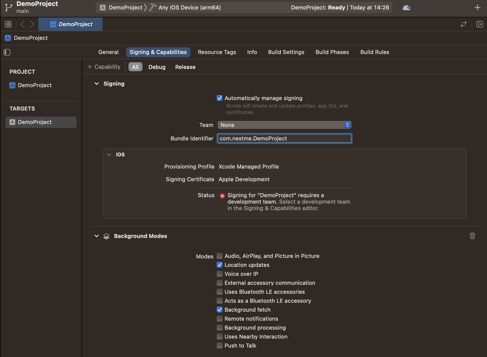
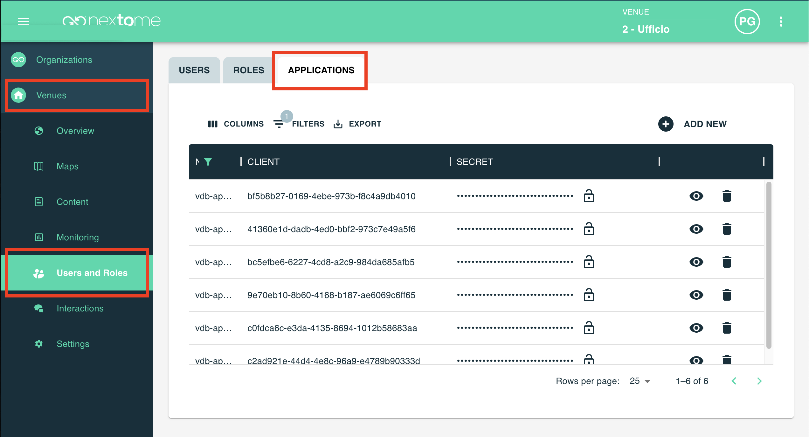

# iOS Integration - Getting started

A full working example app is available on [this repository](https://github.com/Nextome/nextome-phoenix-iOS-whitelabel). Run to see Nextome Sdk in action. It also contains a seamless outdoor/indoor map integration using OpenStreetMap for outdoor and Nextome Flutter Map for indoor.

## Prerequisites

- Xcode 16.2
- Make sure that your project meets these requirements: 
    - Swift 5.7
    - Minimum deployment: iOS 13.2
- Have credentials for jFrog
- Have credentials for our portal

## How to include

### Cocoapods

Nextome Localization is distributed with [Cocoapods](https://guides.cocoapods.org/) using our Podspec repo. Be sure to have CocoaPods installed, or follow [this guide](https://guides.cocoapods.org/using/getting-started.html) to install it.

Then it is necessary to configure our Spec Repo.

1. Add credentials  in the netrc file

    ``` bash 
    nano ~/.netrc
    ```
    Copy this then close and save

    ```
    machine packages.nextome.dev
    login <USERNAME>
    password <ENCRYPTED-PASSWORD>
    ```


    !!! note
        If you get an error of this type: "Permission bits, should be 0600, but are 644"
        
        Run this command: 

        `chmod 0600 ~/.netrc`
     
2. Create a Podfile if you don't already have one. From the root of your project directory, run the following command

    ```bash
    pod init
    ```

6. To your Podfile, be sure that the platform is at least 13.2 then add the CocoaPods specs source and our Nextome source. Then add the NextomeLocalization pod

    ```
    platform :ios, '13.2'

    source 'https://github.com/CocoaPods/Specs.git'
    source 'https://github.com/Nextome/Specs'

    use_frameworks!

    target 'MyApp' do
        pod 'NextomeLocalization'
    end
    ```
    
    !!!note
        If you want to use a specified SDK the version, explicitly it like this
        ```swift
            pod 'NextomeLocalization', '3.2.1'
        ```
        See all released version [here](../iOS/changelog.md)


7. Install the pods, then open your .xcworkspace file to see the project in Xcode

    ```bash
    pod install
    ```

8. Open your `xcworkspace` file


## Setup

In order to work properly the SDK requires to setup some permissions and capabilities:

### Add Background capabilities
If your app needs to compute the position even if it is in background, it is required to add the background capability.

1. Select your project in Xcode’s Project navigator.
2. Select the app’s target in the Targets list.
3. Click the Signing & Capabilities tab in the project editor.
4. Add the background capability

    

5. Add background processing and Location Updates

    

 
### Add permissions

Add these permissions in the `info.plist`:

1. Privacy - Location Always and When In Use Usage Description
2. Privacy - Location Always Usage Description
3. Privacy - Location When In Use Usage Description

### Retrive SDK Credentials
Log-in the web dashboard and retrieve the `Client` and `Secret Key` for the SDK.
Those credentials are available from choosen Venue, Users and Roles at the Applications section.



## SDK Initialization and authentication

It is possible to access all the methods of Nextome using the class `NextomeLocalizationSdk`.
The SDK supports two authentication modes.

Firsty import the Nextome Localization SDK Module
```swift
import NextomeLocalization
```

### ClientSecretCredentials

This is the recommended option when you use the Nextome infrastructure. In this case, authentication is performed using the Client ID and the Secret Key provided by Nextome.

It requires the given `Client` and `Secret Key`.
!!!note
    It is possible to generate or invalidate a given Client and Secret Key using our [web frontend](#retreive-client-and-secret-key).

```swift
val nextomeSdk = NextomeLocalizationSdk(
    baseUrl = nil
    credentials = ClientSecretCredentials(
        clientId = CLIENT_ID,
        clientSecret = CLIENT_SECRET
    ),
    canDebug: false
)
```

When baseUrl is left to null, the SDK uses the default Nextome infrastructure.

### TokenCredentials

This option is intended for integrations that use a custom infrastructure and a custom identity provider. In this case, authentication is performed directly through a token.

```swift
val nextomeSdk = NextomeLocalizationSdk(
    baseUrl = "https://your-own-infrastructure.com"
    credentials = TokenCredentials(
        token = ACCESS_TOKEN
    ),
    canDebug: false
)
```

When using TokenCredentials, the SDK does not manage token refresh automatically.
The token refresh flow must be handled by the integrator and by the host application.
When the token expires or network calls are no longer authenticated, the application must obtain a new token and notify the SDK through:

```swift
nextomeSdk.assignNewAccessToken(token = NEW_ACCESS_TOKEN)
```

Which credentials should I use?
In general, **ClientSecretCredentials** should be used when the application relies on the Nextome infrastructure. This is the simplest and recommended setup.

**TokenCredentials** should be used when the application has its own infrastructure and its own identity provider. In this scenario, the SDK can be pointed to the custom backend through **baseUrl**, and authentication is handled through access tokens generated by the host system.

Notes
If **baseUrl** is null, the SDK uses the Nextome infrastructure.
If you use **TokenCredentials**, token renewal is not handled by the SDK.
The host application is responsible for obtaining a new token and passing it to the SDK with **assignNewToken(newToken: String)**.

!!!note
    By default the SDK works with settings defined in the web portal.<br><br>
    The NextomeLocalizationSdk.Builder allows to override some of those as described in the next sections.
    But please notice that this operation is extremely dangerous and should only be made in accordance with the Nextome Team because has an huge impact on the localization's performance.

## Usage rules permissions

To be localized, the application associated with the client_id entered during initialization must have CORE permissions. These permissions are:

- At least Read permission on the Venues resource
- At least Read permission on the Maps resource
- At least Read permission on the Beacons resource
- At least Read permission on the BeaconModels resource

If the core permission are not granted, the SDK will not works.
Check the role type assigned to the user on the Nextome Hub.

- At least Read permission on the Settgins resource

This permission is not intended to be as core permissions, so no error is fired but it is recommanded to fetching the venue settings correctly.
For example, if you don't see realtime position on Hub Web, but the settings is setted on TRUE, maybe the account associated roles haven't READ on Settings resource.

## Next steps
- See [Start Localization](../start-localization.md) to use Nextome SDK.

## Examples
A full working example app is available on [this repository](https://github.com/Nextome/nextome-phoenix-iOS-whitelabel).


<br>

**© 2026 Nextome srl | All Rights Reserved.**