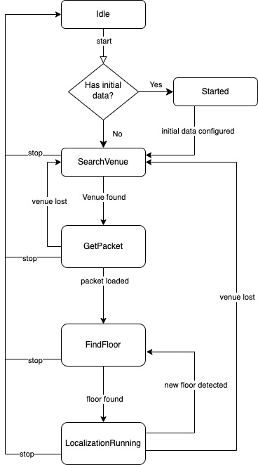

## Use the component
The first step is to delcare a tile and put them into a list.

=== "Android"
    ```kotlin
    TODO
    ```
=== "iOS"
    ```swift
    TODO
    ```


After tiles declaration, the next step consist of the controller declaration. Not mandatory but we can subscribe to onMapReady event

=== "Android"
    ```kotlin
    TODO
    ```
=== "iOS"
    ```swift
    TODO
    ```

The third step consist of the map widget builder that is the widget that will be rendered inside a widget like a Container, a Stack or any other widget

=== "Android"
    ```kotlin
    TODO
    ```
=== "iOS"
    ```swift
    TODO

## Stop localization
When you've done, stop the localization by calling:

=== "Android"
    ```kotlin
    nextomeSdk.stop()
    ```
=== "iOS"
    ```swift
    nextomeSdk.stop()
    ```

## Observe SDK status
It's possible to observe the current state the Nextome SDK.

You can use this data to start initializing the map or showing messages to the users and update your UI accordingly.

=== "Android"
    ```kotlin
    val state: Flow<NextomeSdkState> = nextomeSdk.getStateObservable()
    state.asLiveData().observe(this){state -> 
        
    }
    ```
=== "iOS"
    ```swift
    let observer = nextomeSdk.getStateObservable().watch {state in
    
    }
    ```

    !!!warning
        When you are no longer interested in observing the events, you must detach your listener so that your event callbacks stop getting called.
    
        ```swift
        observer.close()
        ```
         

### Nextome SDK State
`NextomeSdkState` is a simple state machine that can have different states:
<figure markdown>
  
  <figcaption>Nextome SDK State</figcaption>
</figure>

#### IdleState
Nextome SDK has been initialized but there is no active localization service running.

#### StartedState
Nextome has been correctly initialized and started, it's ready to scan beacons;
=== "Android"
    | Property          | Description                         |
    |:------------------|:------------------------------------|
    | `isOutdoor: Bool` | Will always be `true` in this state |
=== "iOS"
    | Property          | Description                         |
    |:------------------|:------------------------------------|
    | `isOutdoor: Bool` | Will always be `true` in this state |