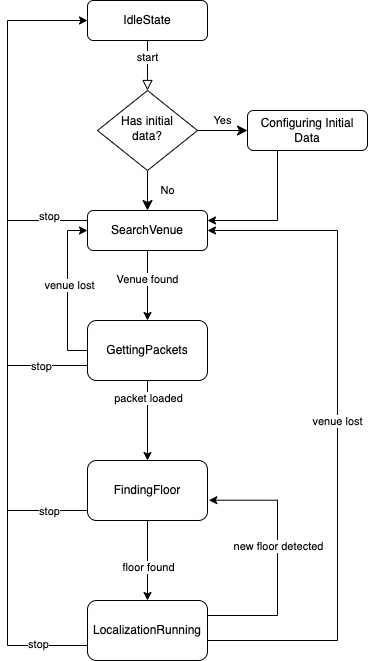

# Android Integration - Getting started

A full working example app is available on [this repository](https://github.com/Nextome/nextome-phoenix-android-whitelabel). Run the MapActivity to see Nextome Sdk in action. It also contains a seamless outdoor/indoor map integration using OpenStreetMap for outdoor and Nextome Flutter Map for indoor.

## Prerequisites
- Your project has min SDK version >= 23;
- Have working credentials for our artifactory repository;
- Have working credentials for our [frontend portal](https://admin.nextome.net/);

!!! warning "Credentials"
    If you need access to artifactory or web frontend, contact us at [info@nextome.com](mailto:info@nextome.com).

### Retreive Client and Secret Key
Log-in the web dashboard and retrieve the `Client` and `Secret Key` for the SDK.
Those credentials are available from your profile, in the Apps section.


## How to include

1. Add our repositories in the Gradle Project Settings `settings.gradle.kts`:

    === "Groovy"
        ``` groovy title="settings.gradle"
        
        dependencyResolutionManagement {
            repositoriesMode.set(RepositoriesMode.FAIL_ON_PROJECT_REPOS)
            repositories {
                ...
                maven { url "https://jitpack.io" }
                maven {
                    url "https://nextome.jfrog.io/artifactory/nextome-libs-release-local"

                    credentials {
                        username "USERNAME"
                        password "PASSWORD"
                    }
                }
            }
        }
        ```
    === "KTS"
        ``` kotlin title="settings.gradle.kts"
    
        dependencyResolutionManagement {
            repositoriesMode.set(RepositoriesMode.FAIL_ON_PROJECT_REPOS)
            repositories {
                ...
                maven { url = uri("https://jitpack.io)" }
                maven {
                    url = uri("https://nextome.jfrog.io/artifactory/nextome-libs-release-local")

                    credentials {
                        username = "USERNAME"
                        password = "PASSWORD"
                    }
                }
            }
        }
        ```

2. In your module (app-level) Gradle file, add the dependency for the SDK:

    === "Groovy"

        ``` groovy title="project/build.gradle"
        implementation 'net.nextome.phoenix_sdk:phoenix-sdk:{last_version}'
        ```

    === "KTS"

        ``` kotlin title="project/build.gradle.kts"
        implementation ("net.nextome.phoenix_sdk:phoenix-sdk:{last_version}")
        ```
    Check latest released version [here](/docs/Nextome%20SDK/Android/changelog.md)

## Required permissions
To run, Nextome SDK requires the following permissions:
```xml title="AndroidManifest.xml"
    <uses-permission android:name="android.permission.INTERNET" />
    <uses-permission android:name="android.permission.POST_NOTIFICATIONS"/>
    <uses-permission android:name="android.permission.ACCESS_NETWORK_STATE" />
    
    <!-- needed to retrieve GPS position when outdoor -->
    <uses-permission android:name="android.permission.ACCESS_FINE_LOCATION" />
    <uses-permission android:name="android.permission.ACCESS_COARSE_LOCATION" />
    
    <!-- needed to scan and connect to beacons -->
    <uses-permission android:name="android.permission.BLUETOOTH"
                     android:maxSdkVersion="30" />
    <uses-permission android:name="android.permission.BLUETOOTH_ADMIN"
                     android:maxSdkVersion="30" />
    
    <uses-permission android:name="android.permission.BLUETOOTH_SCAN" />
    <uses-permission android:name="android.permission.BLUETOOTH_CONNECT" />
    <uses-permission android:name="android.permission.BLUETOOTH_ADVERTISE" />
    
    <!-- needed for background localization -->
    <uses-permission android:name="android.permission.ACCESS_BACKGROUND_LOCATION" />
    <uses-permission android:name="android.permission.FOREGROUND_SERVICE" />
```

!!!note 
    The app integrating Nextome needs to ask the appropriate permissions and make sure they are accepted by the user.

## SDK Initialization
It is possible to access all the methods of Nextome using the class `NextomePhoenixSdk`.
It requires the `application context`, the given `Client` and `Secret Key`.

!!!note
    It is possible to generate or invalidate a given Client and Secret Key using our [web frontend](#retreive-client-and-secret-key). 

```kotlin
    nextomeSdk = NextomePhoenixSdk(
        clientId = CLIENT_ID,
        clientSecret = CLIENT_SECRET,
        context = context as ApplicationContext,
    )
```
!!!warning
    By default the SDK works with settings defined on the web frontend.<br><br>
    If you know what you are doing, you can override those settings as described [here](settings.md).
    However, we strongly suggest to consult Nextome team before, since they can 
    degrade sdk performances and cause phone battery drain.

## Start localization
To start localization, call:

```kotlin
nextomeSdk.start()
```

If you want Nextome to keep track of user indoor position also while the phone screen is off or your app is in background explore the corresponding section [here](background-service.md).

## Stop localization
When you've done, stop the localization by calling:

```kotlin
nextomeSdk.stop()
```

## Observe SDK status
It's possible to observe the current state the Nextome SDK.

You can use this data to start initializing the map or showing messages to the users and update your UI accordingly.

```kotlin
val state: Flow<NextomeSdkState> = nextomeSdk.getStateObservable()
state.asLiveData().observe(this){state -> 
    
}
```
### Nextome SDK State
`NextomeSdkState` is a simple state machine that can have different states:
<figure markdown>
  
  <figcaption>Nextome SDK State</figcaption>
</figure>

#### IdleState
Nextome SDK has been initialized but there is no active localization service running.

#### StartedState
Nextome has been correctly initialized and started, it's ready to scan beacons;

| Property          | Description                         |
|:------------------|:------------------------------------|
| `isOutdoor: Bool` | Will always be `true` in this state |

#### SearchVenueState
Nextome is currently scanning nearby beacons to determine in which venue the user is; If the SDK is stuck here, you're probably outdoor.

| Property          | Description                         |
|:------------------|:------------------------------------|
| `isOutdoor: Bool` | Will always be `true` in this state |

#### GetPacketState
Nextome knows the venue of the user and it's downloading from the server the associated resources (Maps, POIs, Patches...);

| Property          | Description                          |
|:------------------|:-------------------------------------|
| `isOutdoor: Bool` | Will always be `false` in this state |
| `venueId: Int`    | The venueId of the venue found       |

#### FindFloorState
All the venue resources have been downloaded. Nextome is now computing in which floor the user is;

| Property                       | Description                                                                                                                               |
|:-------------------------------|:------------------------------------------------------------------------------------------------------------------------------------------|
| `isOutdoor: Bool`              | Will always be `false` in this state                                                                                                      |
| `venueId: Int`                 | The venueId of the venue found                                                                                                            |
| `venuePackage: NextomePackage` | Contains all the resources (beacons, pois, maps, events, path and settings) for a specific venue. See more [here](additional-features.md) |

#### LocalizationRunningState

Nextome SDK is computing user positions. You can observe live user location using the observer `nextomeSdk.locationLiveData`;

| Property                       | Description                                                                                                                              |
|:-------------------------------|:-----------------------------------------------------------------------------------------------------------------------------------------|
| `isOutdoor: Bool`              | Will always be `false` in this state                                                                                                     |
| `venueId: Int`                 | The venueId of the venue found                                                                                                           |
| `venuePackage: NextomePackage` | Contains all the resources(beacons, pois, maps, events, path and settings) for a specific venue. See more [here](additional-features.md) |
| `mapId: Int`                   | Id of the map (floor) in which the user was localized                                                                                    |
| `tileZipPath: String`          | The local path of the zip file which contains the tiles for the current map                                                              |
| `mapHeight: Int`               | The height in pixel of the map                                                                                                           |
| `mapWidth: Int`                | The width in pixel of the map                                                                                                            |

It is possible to use `tileZipPath`, `mapHeight` and `mapWidth` to show the user a live map of the current floor.
See more on [Nextome Map integration docs]().

#### ErrorState
The SDK was stopped due to a fatal error. It exposes a NextomeException which can be either a GenericException or InvalidCredentialException.
If the error is fatal, localization will not resume automatically. It is possible to correct the error and start Nextome SDK again.

!!!note 
    - If the user **changes floor**, the SDK will resume from `FIND_FLOOR` state.
    - If the user goes **outdoor**, the SDK will switch to `SEARCH_VENUE` state until a new indoor beacon is detected.

### Complete example
??? example "Example: getStateObservable()"
    ```kotlin
    nextomeSdk.getStateObservable().collect { state ->
            when (state) {
                is IdleState -> {
                    showOpenStreetMap()
                    updateState("Sdk is Idle")
                }
                is StartedState -> {
                    showOpenStreetMap()
                    updateState("Sdk Started")
                }

                is SearchVenueState -> {
                    showOpenStreetMap()
                    updateState("Searching Venue...")
                }

                is GetPacketState -> {
                    showOpenStreetMap()
                    updateState("Downloading venue ${state.venueId}...")
                }

                is FindFloorState -> {
                    showOpenStreetMap()
                    updateState("Finding current Floor on venue ${state.venueId}...")
                }

                is LocalizationRunningState -> {
                    updateState("Showing map of floor ${state.mapId}...")
                    showIndoorMap()
                    setIndoorMap(state.tilesZipPath,
                        state.mapHeight,
                        state.mapWidth,
                        state.venuePackage.getPoisByMapId(state.mapId)
                    )
                    poiList = state.venuePackage.allPois
                }

                is ErrorState -> {
                    handleError(state.exception)
                }
            }

        }
    ```
## Observe the user position
Nextome SDK offers an observable to listen to user position updates:

```kotlin
nextomeSdk.getLocalizationObservable().collect { 
   log("Localized at (${it.x}, ${it.y}), on venue ${it.venueId} on map ${it.mapId})") 
}
```
#### NextomePosition

| Property         | Description                                                                  |
|:-----------------|:-----------------------------------------------------------------------------|
| `x: Double`      | The x coordinates of the computed position.                                  |
| `y: Double`      | The y coordinates of the computed position.                                  |
| `venueId: Int`   | The venueId of the venue found.                                              |
| `mapId: Int`     | The mapId (floor) of the computed position.                                  |
| `label: String?` | A label associated with the position (see [label in additional features]()). |

## Observe errors
```kotlin
            nextomeSdk.getErrorsObservable().collect { error ->
                Log.e(TAG, "New error received: ${error.message}")
    
                when (error) {
                    is NextomeException.GenericException -> {
                        showMessageEvent(message = error.message)
                    }

                    is NextomeException.InvalidCredentialException -> {
                        logOutAndShowLoginScreen()
                    }

                    is NextomeException.CriticalException -> {
                        showMessageEvent(message = error.message)
                        // Need to restart sdk
                    }
                }
            }    
```

## Offline capability
With the migration from 0.X.X to 1.X.X the SDK can also work offline by default if the resources of the venue were downloaded at least the first time. 
It is also possible to provide the SDK initial resources to let the app work offline from the start. More info are available [here](additional-features.md).

## Next steps

- Visit [Background-service](background-service.md) to learn how to use the SDK even when the app is not opened in the foreground.

- See the [Additional features](additional-features.md) available, like events observers.

- Visit [Flutter map integration](flutter-map-integration.md)if you want to use our library to display the indoor map.

## Examples
A full working example app is available on [this repository](https://github.com/Nextome/nextome-phoenix-android-whitelabel).
Run the `MapActivity` to see Nextome Sdk in action. It also contains a seamless outdoor/indoor map integration using *OpenStreetMap* for outdoor and *Nextome Flutter Map* for indoor.


<br>

**© 2021 Nextome srl | All Rights Reserved.**
